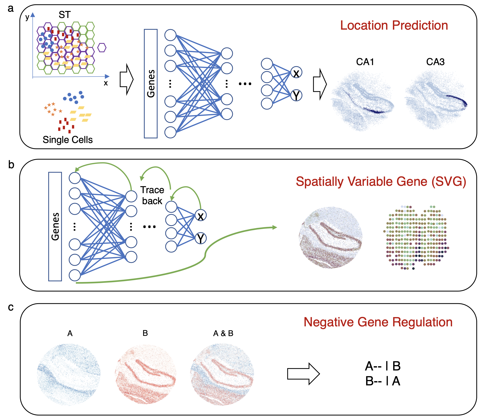

[](https://pypi.org/project/SC2Spa)
[](https://sc2spa.readthedocs.io)

SC2Spa: a deep learning based approach to map transcriptome to spatial origins at cellular resolution
====================================================================================

<p align="center">
  
</p>

## Install
Install SC2Spa via PyPI by running:
```
pip install SC2Spa
```

## Analysis for the SC2Spa manuscript
The analysis for the SC2Spa manuscript can be found [here](https://github.com/linbuliao/SC2Spa_Notebooks)


## Many more to come!
We will update more on our [Read the Docs page](https://sc2spa.readthedocs.io/en/latest/)

## News

__2023/08/22__  
SC2Spa is now on BioRXiv!
https://www.biorxiv.org/content/10.1101/2023.08.22.554277v1
